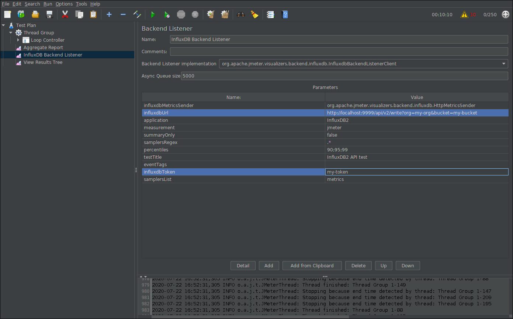

# Apache JMeter Template

Provided by: [bonitoo.io](.)


**This template provides Apache JMeter dashboard**

> The Apache JMeter™ application is open source software, a 100% pure Java application designed to load test functional behavior and measure performance. It was originally designed for testing Web Applications but has since expanded to other test functions.

The Apache JMeter test can be set up to send data to InfluxDB. The InfluxDB
dashboard provides beautiful visualizations of the collected test results in
time.


JMeter metrics available in this dashboard:

- **Request count**, successful and failing
- **Max**, **min**, **avg** **response time** per transaction
- **Percentiles**
- **User count**
- **Number of hits**
- Number of **sent** and **received** **bytes**

### Quick Install

#### InfluxDB UI

In the InfluxDB UI, go to Settings->Templates and enter this URL: https://raw.githubusercontent.com/influxdata/community-templates/master/apache_jmeter/apache_jmeter.yml

#### Influx CLI
If you have your InfluxDB credentials [configured in the CLI](https://v2.docs.influxdata.com/v2.0/reference/cli/influx/config/), you can install this template with:

```
influx apply -u https://raw.githubusercontent.com/influxdata/community-templates/master/apache_jmeter/apache_jmeter.yml
```

## Included Resources

The template consists of the following:

    - 1 Dashboard: `JMeter`
    - 1 Variable: `bucket`

The sample **Test Plan** boilerplate project in the `samples` directory.


## Setup Instructions

General instructions on using InfluxDB Templates can be found in the [use a template](../docs/use_a_template.md) document.

**Import the template**

```
 influx apply --file ./apache_jmeter.yml
```

**Start with a sample test project:**

> The *sample Test Plan* is written to test the influxd itself. Before you run the test, make sure you have started the local `influxd` command and the InfluxDB 2.x is running on your localhost.

**To start** with the sample test project, follow these steps:

1. Install Apache JMeter - http://jmeter.apache.org/download_jmeter.cgi, 
1. Install InfluxDB 2.x on your localhost
1. Start Apache JMeter and open the `Test Plan.jmx` Apache JMeter project located in the `./samples` directory.
1. Inside of the JMeter application, set up the `my-org`, `my-bucket` and `my-token` variables in the project. Open **Test Plan** > **Thread Group** in the project tree
   - **Loop Controller** > **Auth Header Setup**, modify the header `Authorization` value to `Token my-token`
   - update the following parameters on the **InfluxDB Backend Listener**, see the screenshot 2 below,
      - `influxdbUrl` the params `org` and `bucket` 
      - `influxdbToken` the value `my-token`

    Screenshot 2: Apache JMeter configuration, the relevant Parameters are hilited:
    
1. Run the Test

The dashboard should start presenting the results. You can also see the *write*
transaction is being shown in the *KO request count* cell. This is intentional.
You can fix this in the Apache JMeter project by configuring the bucket that is used to store random weather data.

As a result, you are ready to create your advanced test project integrated with the InfluxDB.

## Customizations

n/a

## Contact

Author: Ivan Kudibal, https://www.bonitoo.io

Github: @ivankudibal

Influx Slack: @ivankudibal