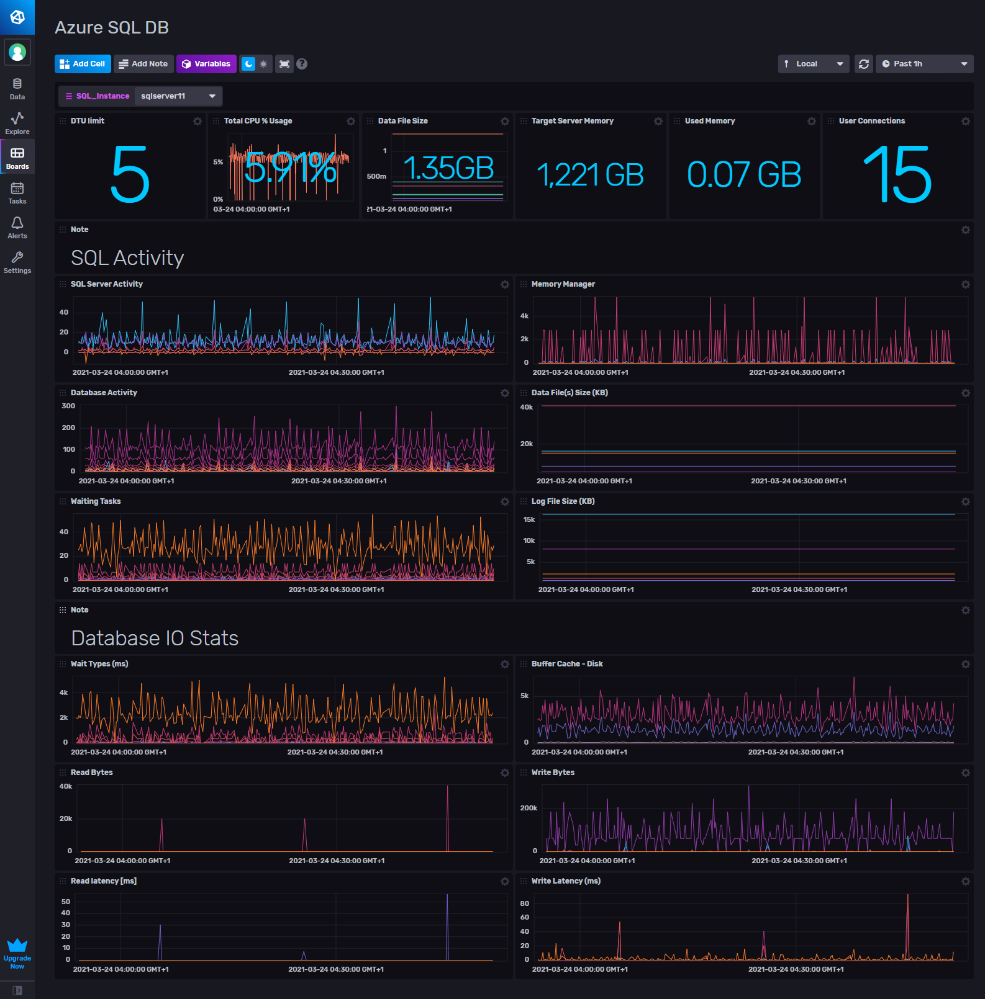

# Azure SQL Server Template for InfluxDB v2

Provided by: [bonitoo.io](.)

This Dashboard offers you information about your Azure SQL Database: CPU utilization, Memory, Database Size, Active Threads, Connections, Traffic and more.



## Quick Install

### InfluxDB UI

In the InfluxDB UI, go to Settings->Templates and enter this URL: https://github.com/influxdata/community-templates/blob/master/azure_sql_db/azure_sql_db.yml

### Influx CLI

If you have your InfluxDB credentials [configured in the CLI](https://v2.docs.influxdata.com/v2.0/reference/cli/influx/config/), you can install this template with:

```
influx apply -u https://github.com/influxdata/community-templates/blob/master/azure_sql_db/azure_sql_db.yml
```

## Included Resources

- 1 Telegraf Configuration: 'azure-sql-config'
- 1 Dashboards: 'Azure SQL DB'
- 1 Label: 'mssql'
- 1 Bucket: 'AzureSQLDB'
- 1 Variable: 'SQL_Instance'

## Setup Instructions

General instructions on using InfluxDB Templates can be found in the [use a template](../docs/use_a_template.md) document.

Telegraf Configuration requires the following environment variables

- `INFLUX_TOKEN` - The token with the permissions to read Telegraf configs and write data to the `telegraf` bucket. You can just use your operator token to get started.
- `INFLUX_ORG` - The name of your Organization.
- `INFLUX_HOST` - The address of you InfluxDB.
- `AZURE_SQL_SERVER` - Specify instances to monitor with a list of connection strings.
  
  Example:

```
  Server=sqlserver11.database.windows.net;Port=1433;User Id=bonitoo;Password=xxxx;app name=telegraf;log=1;Initial Catalog=demo;Persist Security Info=False;MultipleActiveResultSets=False;Encrypt=True;TrustServerCertificate=False;Connection Timeout=30
```

## Contact

Author: Miroslav Malecha, https://www.bonitoo.io