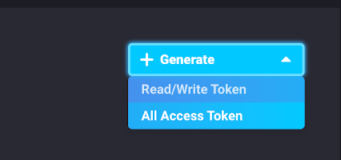

# Use a Template

Each template provides a manifest file and instructions for using the template.
To import a template, use the following command:

```
 influx pkg --org <organization_name> --file ~/path/to/template/manifest.yml
 ```

This imports the specified `manifest.yml` into an instance of InfluxDB running on `localhost`.

> Manifest files can be YAML, JSON or Jsonnet.

If you don't want to download the manifest file locally, you can point to its remote location using the `--url` flag, for example:
```
 influx pkg --org <organization_name> --url https://raw.githubusercontent.com/influxdata/community-templates/master/template/manifest.yml
 ```

 ## Use Templates in InfluxDB Cloud

If you are using InfluxDB Cloud platform you will need provide the [URL of your InfluxDB zone](https://v2.docs.influxdata.com/v2.0/cloud/urls/) using the `--host` flag. For example `https://us-west-2-1.aws.cloud2.influxdata.com`. 

```
 influx pkg --org <organization_name> --file ~/path/to/template/manifest.yml --host <influxdb_cloud_host> --token <token>
```

> Your default organization name in InfluxDB Cloud will be your email address.

To apply templates and download Telegraf configurations from InfluxDB Cloud, create an **All Access Token**. You can [create this token](https://v2.docs.influxdata.com/v2.0/security/tokens/create-token/) from the `Load Data` -> `Tokens` section of the UI.




 ## Use Templates in a remote instance

If running InfluxDB on a remote server, provide the URL of your InfluxDB instance using the `--host` flag and provide your InfluxDB authentication token using the ``--token`` flag:

```
 influx pkg --org <organization_name> --file ~/path/to/template/manifest.yml --host <hostname> --token <token>
```


> Need help? You can find [support](../README.md#support) information at the bottom of the main page.
