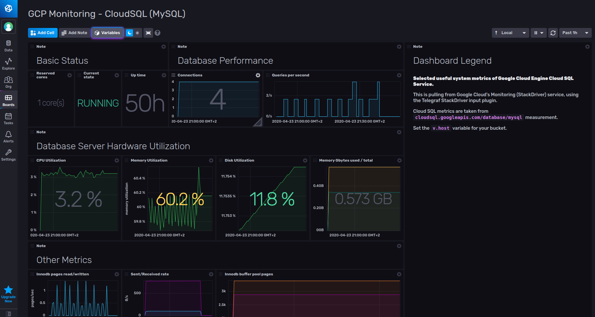
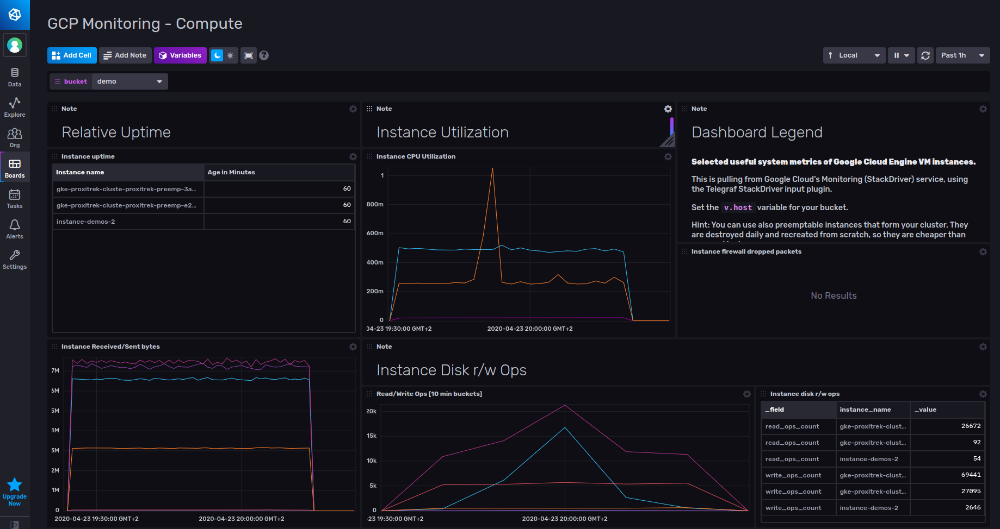
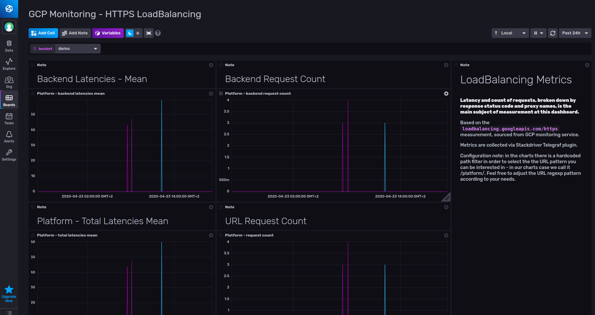

# Google Cloud Platform Monitoring template

Provided by: [bonitoo.io](.)

**Display data from Google Cloud Monitoring -- formerly Stackdriver -- using the
Cloud Monitoring API v3. There are three dashboards in this template.**

- The CloudSQL dashboard -- displays metrics of MySQL database hosted in Google
   Cloud SQL.
- The Compute dashboard -- it provides deeper insight into the GCP compute
   services provided by GCP Stackdriver.
- The HTTPS LoadBalancing dashboard monitors network load balancing in the cluster.

##### Dashboard examples





### Quick install

If you have your InfluxDB credentials [configured in the CLI](Vhttps://v2.docs.influxdata.com/v2.0/reference/cli/influx/config/), you can install this template with:

```
influx apply -f https://raw.githubusercontent.com/influxdata/community-templates/master/gcp_monitoring/gcp_monitoring.yml
```

## Included resources

This template includes the following:

- 2 Labels: `inputs.stackdriver`, `GCP`
- 3 Dashboards: `CloudSQL`, `Compute` and `HTTPS LoadBalancing`
- 1 Variable: `bucket`
- 1 Telegraf Config: `GCP Stackdriver`

## Setup instructions


Load the dashboards and use the Telegraf Stackdriver plugin into your
environment.

An example command:
```bash
 $ ${INFLUX_PATH}/influx apply --org qa --file ${myTemplateFile} -t ${INFLUX_TOKEN}
```

Include the [Telegraf Stackdriver plugin](https://github.com/influxdata/telegraf/tree/master/plugins/inputs/stackdriver) in your Telegraf configuration and start Telegraf.


Visit the dashboard and use the `v.bucket` variable to select which bucket the data is stored in.


## Customizations

n/a

## Contact

Author: Ivan Kudibal, Tomas Klapka, https://www.bonitoo.io

Github: @ivankudibal
