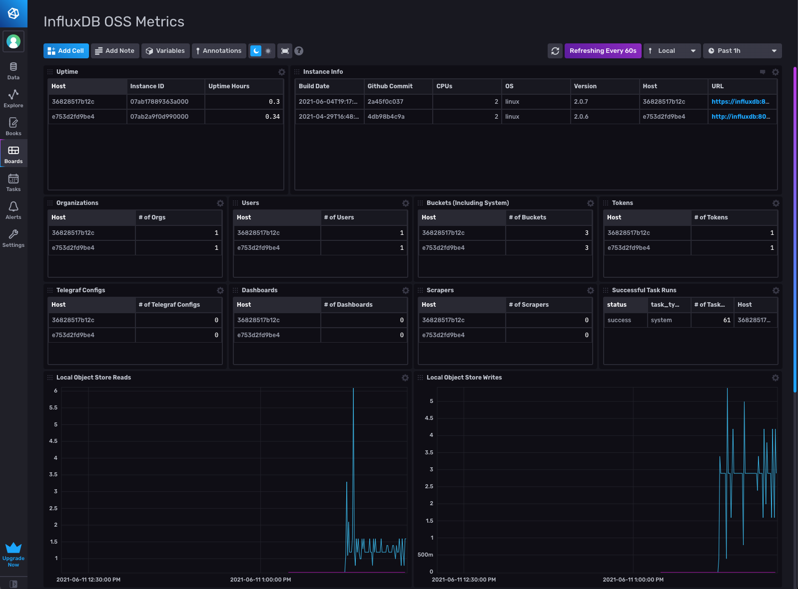

# InfluxDB 2 Open Source Metrics Template

Provided by: InfluxData

This InfluxDB Template can be used to monitor your already running InfluxDB 2 instance being collected by the built in prometheus scraper or the included Telegraf configuration. This template can be used to monitor your locally running InfluxDB OSS instances in your free InfluxDB Cloud account.



### Quick Install

#### InfluxDB UI

In the InfluxDB UI, go to Settings->Templates and enter this URL: https://raw.githubusercontent.com/influxdata/community-templates/master/influxdb2_oss_metrics/influxdb2_oss_metrics.yml

#### Influx CLI
If you have your InfluxDB credentials [configured in the CLI](https://v2.docs.influxdata.com/v2.0/reference/cli/influx/config/), you can install this template with:

```
influx apply -u https://raw.githubusercontent.com/influxdata/community-templates/master/influxdb2_oss_metrics/influxdb2_oss_metrics.yml
```

## Included Resources

  - 1 Bucket: `oss_metrics`, 7d retention
  - 2 Labels: `InfluxDB2`,`prometheus`
  - 1 Dashboard: `InfluxDB OSS Metrics`
  - 1 Telegraf Config: `Scrape InfluxDB OSS Metrics`

## Setup Instructions

  General instructions on using InfluxDB Templates can be found in the [use a template](../docs/use_a_template.md) document.

  The data for the dashboard can be populated by either the data collected by the built in prometheus scraper in your InfluxDB OSS instance or using the included Telegraf configuration. Using the Telegraf configuration allows you to use this template in your InfluxDB Cloud account to monitor your open source instances. The best way to set this up is to first follow the instructions for installing any template. That will create the labels, bucket, dashboard and Telegraf config for you.

  Then, if you are installing this in your local InfluxDB OSS instance, open the InfluxDB UI (usually found at http://localhost:8086 in your browser) and configure a default scraper to write the scrape data from `http://localhost:8086/metrics` into the `oss_metrics` bucket. 

  More information about scrapers can be found in our [documentation](https://v2.docs.influxdata.com/v2.0/write-data/scrape-data/).


  
  If you are installing into your InfluxDB Cloud account, you would want to install a Telegraf agent on each host where InfluxDB OSS is running and start it with the included config. You will need to configure the following ENV variables for your Telegraf config to run:
    
    - INFLUX_URL: This is the url for your cloud account such as https://us-west-2-1.aws.cloud2.influxdata.com
    - INFLUX_ORG: This is your organization name for your InfluxDB Cloud account.
    - INFLUX_CLOUD_TOKEN: This is a token with write permissions to the `oss_metrics` bucket. You can create one in your browser by logging into your InfluxDB Cloud account and clicking Data > Tokens.
    - INFLUX_TOKEN: This is a token that Telegraf would use to fetch the remote config from your InfluxDB Cloud account. It could be the same as the INFLUX_CLOUD_TOKEN above if you are using an all access token.

  Once you set those ENV variables, you can use the setup instructions for the Telegraf config found in your InfluxDB Cloud account.

## Customizations

  There are many more metrics collected than the ones displayed on the dashboard. Check out localhost:8086/metrics for a full list. They are also available by exploring the data populated in the `oss_metrics` bucket.

## Contact

- Author: Russ Savage
- Email: russ@influxdata.com
- Github: [@russorat](https://github.com/russorat)
- Influx Slack: [@russ](https://influxdata.com/slack)
