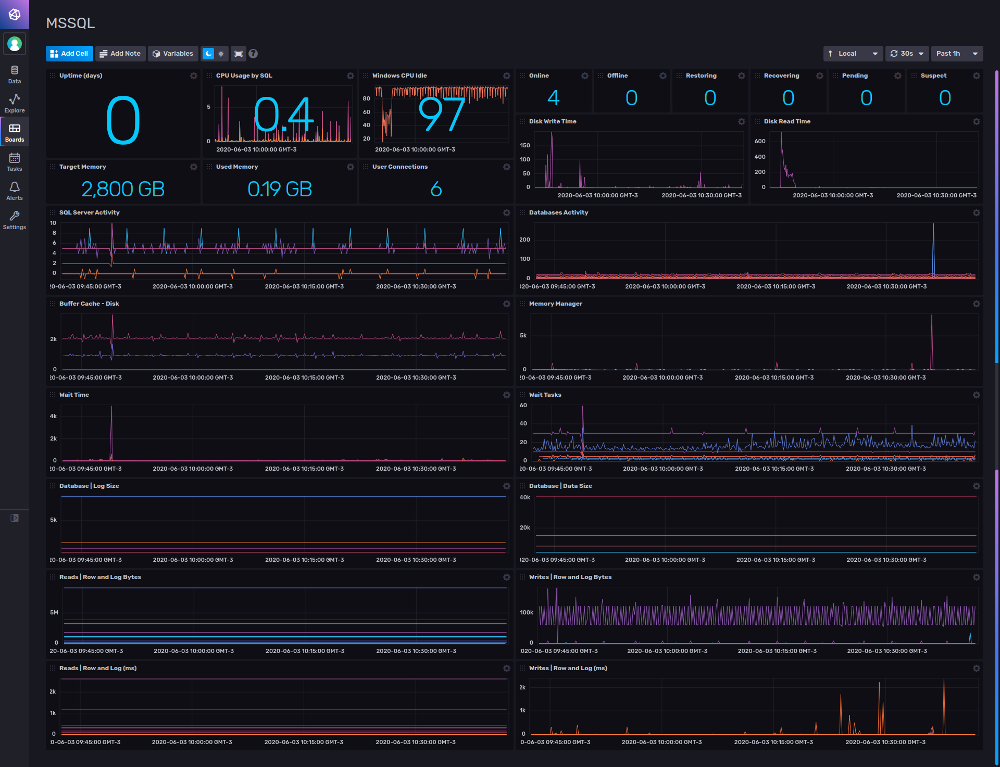

# Microsoft SQL Server Template for InfluxDB v2

Provided by: Ignacio Van Droogenbroeck

This Dashboard offers you information about your Microsoft SQL Server. Uptime, Current Queries. Active Threads, Connections, Locks, Traffic and more.



### Quick Install

#### InfluxDB UI

In the InfluxDB UI, go to Settings->Templates and enter this URL: https://raw.githubusercontent.com/influxdata/community-templates/master/mssql/mssql.yml

#### Influx CLI
If you have your InfluxDB credentials [configured in the CLI](https://v2.docs.influxdata.com/v2.0/reference/cli/influx/config/), you can install this template with:

```
influx apply -u https://raw.githubusercontent.com/influxdata/community-templates/master/mssql/mssql.yml
```

## Included Resources

  - 1 Telegraf Configuration: 'mssql-config'
  - 1 Dashboards: 'MSSQL'
  - 1 Label: 'mssql'
  - 1 Bucket: 'mssql'
  - 1 Variable: 'mssqlType'

## Setup Instructions

General instructions on using InfluxDB Templates can be found in the [use a template](../docs/use_a_template.md) document.

Telegraf Configuration requires the following environment variables
  - `INFLUX_TOKEN` - The token with the permissions to read Telegraf configs and write data to the `telegraf` bucket. You can just use your operator token to get started.
  - `INFLUX_ORG` - The name of your Organization.
  - `INFLUX_HOST` - The address of you InfluxDB
  - `INFLUX_BUCKET` - The name of the Bucket. If you going to use the bucket included, you need to export the variable. Ex: ```INFLUX_BUCKET=mssql```

## Additional Instructions For Azure DB

The template can be used to monitor SQL database service in Azure.

Proceed with the general instructions above. Download the Telegraf config and set up the following:

```
  servers = [
  "Server=DBHOST.database.windows.net;Port=1433;User Id=DBUSER;Password=DBPSWD;app name=DBNAME;log=1;",
]
  azuredb = true
```

Use the `mssqlType` variable to see data inside the `Wait Time` and `Wait Tasks` dashboard cells.

Note: Windows CPU metrics will not work if you point dashboard at SQL Database Service in Azure.

## Contact

Author: Ignacio Van Droogenbroeck

Email: ignacio[at]vandroogenbroeck[dot]net

Github and Gitlab user: @xe-nvdk

Influx Slack: Ignacio Van Droogenbroeck
