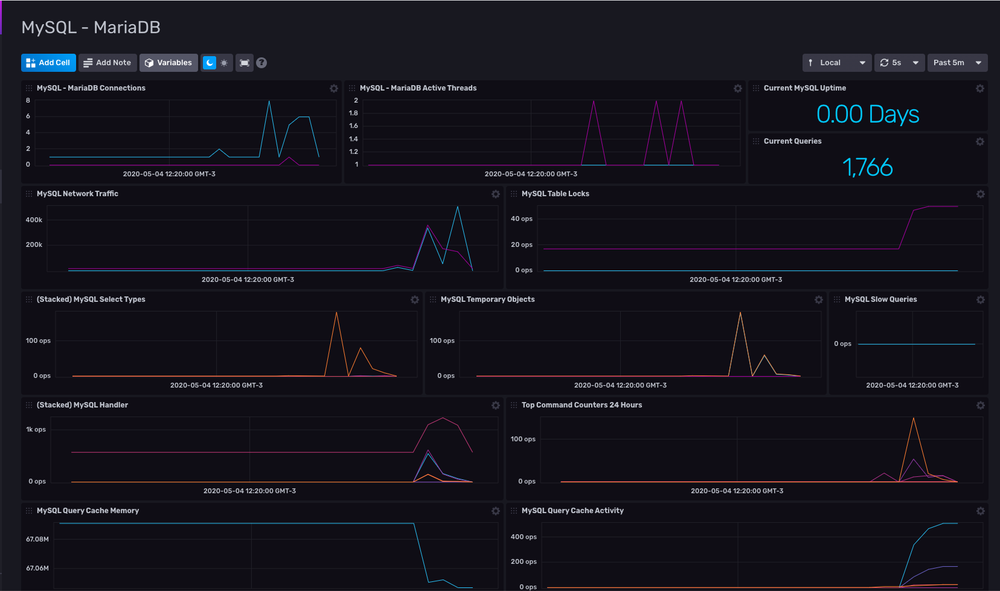

# MySQL / MariaDB Dashboard for InfluxDB v2

Provided by: Ignacio Van Droogenbroeck

This Dashboard offers you information about your MySQL/MariaDB instance. Uptime, Current Queries. Active Threads, Connections, Locks, Traffic and more.



### Quick Install

#### InfluxDB UI

In the InfluxDB UI, go to Settings->Templates and enter this URL: https://raw.githubusercontent.com/influxdata/community-templates/master/mysql_mariadb/mysql_mariadb.yml

#### Influx CLI
If you have your InfluxDB credentials [configured in the CLI](https://v2.docs.influxdata.com/v2.0/reference/cli/influx/config/), you can install this template with:

```
influx apply -u https://raw.githubusercontent.com/influxdata/community-templates/master/mysql_mariadb/mysql_mariadb.yml
```

## Included Resources

  - 1 Telegraf Configuration: 'mysql-mariadb'
  - 1 Dashboards: 'MySQL - MariaDB'
  - 1 Label: 'mysql'
  - 1 Bucket: 'mariadb'

## Setup Instructions

General instructions on using InfluxDB Templates can be found in the [use a template](../docs/use_a_template.md) document.

Telegraf Configuration requires the following environment variables
  - `INFLUX_TOKEN` - The token with the permissions to read Telegraf configs and write data to the `telegraf` bucket. You can just use your operator token to get started.
  - `INFLUX_ORG` - The name of your Organization.
  - `INFLUX_HOST` - The address of you InfluxDB
  - `INFLUX_BUCKET` - The name of the Bucket. If you going to use the bucket included, you need to export the variable. Ex: ```export INFLUX_BUCKET=mariadb```

In order to use this Dashboard, you need to specify the connection string to the mySQL/MariaDB instance as variable. The same needs to define user and password (read only recommended)

ex: ```$ export $MYSQL_CONNECTION_STRING=user@tcp(127.0.0.1:3306)/?tls=false```

## Contact

Author: Ignacio Van Droogenbroeck

Email: ignacio[at]vandroogenbroeck[dot]net

Github and Gitlab user: @xe-nvdk

Influx Slack: Ignacio Van Droogenbroeck
