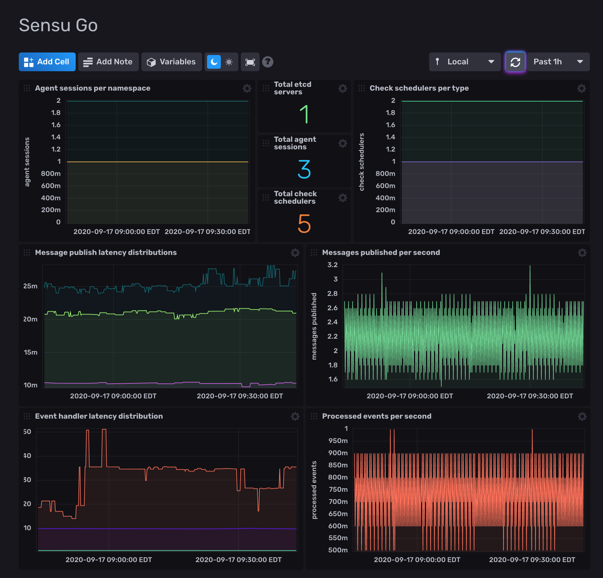

## Sensu Go Monitoring Template

This InfluxDB Template can be used to monitor the performance of your Sensu Go observability tool with Telegraf and Prometheus.



### Quick Install

#### InfluxDB UI

In the InfluxDB UI, go to Settings->Templates and enter this URL: https://raw.githubusercontent.com/influxdata/community-templates/master/sensu_go/sensu_go.yml

#### Influx CLI

If you have your InfluxDB credentials [configured in the CLI](https://v2.docs.influxdata.com/v2.0/reference/cli/influx/config/), you can install this template with:

```
influx apply -u https://raw.githubusercontent.com/influxdata/community-templates/master/sensu_go/sensu_go.yml
```

### Included Resources

- 1 Bucket: `telegraf`, 7d retention
- Labels: `Sensu Go Template` + Telegraf Plugin Labels
- 1 Telegraf Configuration
- 1 Dashboard: `Sensu Go`
- 1 Variable: `bucket`

## Setup Instructions

  General instructions on using InfluxDB Templates can be found in the [use a template](../docs/use_a_template.md) document.
    
  The data for the dashboard is populated by the included Telegraf configuration. The Telegraf Configuration requires the following environment variables
    
  - `INFLUX_TOKEN` - The token with the permissions to read Telegraf configs and write data to the `telegraf` bucket. You can just use your operator token to get started.
  - `INFLUX_ORG` - The name of your Organization (this will be your email address on the InfluxDB Cloud free tier)
  - `INFLUX_HOST` - The URL of your InfluxDB host (this can your localhost, a remote instance, or InfluxDB Cloud)

  You **MUST** set these environment variables before running Telegraf using something similar to the following commands
    
  - This can be found on the `Load Data` > `Tokens` page in your browser: `export INFLUX_TOKEN=TOKEN`
  - Your Organization name can be found on the Settings page in your browser: `export INFLUX_ORG=my_org`

## Running Telegraf

  To get resource data from your Linux hosts, [download and install Telegraf](https://portal.influxdata.com/downloads/) on those hosts. InfluxData provides native packages for a number of distributions as well as binaries that can be executed directly.

  Start Telegraf using the instructions from the `Load Data` > `Telegraf` > `Setup Instructions` link in the UI.

## Customizations

You can customize it based on your Sensu installation. More information can be found in the Sensu Go [backend configuration](https://docs.sensu.io/sensu-go/latest/observability-pipeline/observe-schedule/backend/#configuration-summary) and [/metrics endpoint](https://docs.sensu.io/sensu-go/latest/api/metrics) documentation.

## Contact

- Author: Nikki Attea
- Email: contact@nikki.dev
- Github: [@nikkictl](https://github.com/nikkictl)
- Influx Slack: [@nikki](https://influxdata.com/slack)
- Website: https://nikki.dev